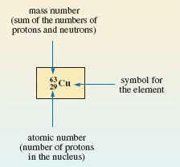
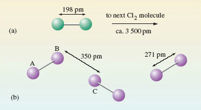
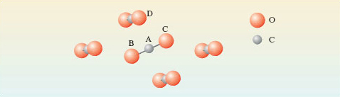
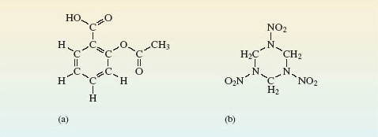

# 1 Everything that you can see is made of atoms

## 1.1 Introduction

The idea that everything that we can see is an assembly of tiny particles called atoms is chemistry's greatest contribution to science. There are about 120 known kinds of atom, and each one is distinguished by a name, by a chemical symbol, and by a number called the __atomic number__. The meaning of atomic number is best understood from the Rutherford model of the atom (<a xmlns:str="http://exslt.org/strings" href="">Figure 1</a>). Each atom has a tiny positively charged *nucleus*, where nearly all of its mass resides. Around this nucleus move negatively charged particles called *electrons*. Any atom is electrically neutral, but each electron carries a negative charge, to which we give the symbol −*e*.

						Figure 1 The Rutherford model of the atom.

Figure 1
         ##-- SAQ
        <h1 xmlns:str="http://exslt.org/strings">Question 1</h1>

#### Question

>So what is the charge carried by the nucleus of the atom in Figure 1?

+6*e*; the atom in Figure 1 contains six electrons whose total charge will be −6*e*. To generate an overall charge of zero, the positive charge on the nucleus must be +6*e*.

         ##-- ENDSAQ
    
In fact, the positive charge on the nucleus of any atom is provided by minute positively charged particles called *protons*, each of which carries a charge of +*e*.

         ##-- SAQ
        <h1 xmlns:str="http://exslt.org/strings">Question 2</h1>

#### Question

>How many protons are there in the nucleus of the atom in Figure 1?

6; the nucleus carries a total charge of +6*e*, and each proton has a charge of +*e*.

         ##-- ENDSAQ
    
The atomic number of an atom is the number of protons in its nucleus. It is also equal to the number of electrons in the neutral atom. The atomic number of the atom in Figure 1 is therefore six.

## 1.2 Chemical elements

Atoms of the same atomic number behave virtually identically in chemical reactions. They are therefore given the same chemical name and chemical symbol. For example, the atom of atomic number 6, which is shown in <a xmlns:str="http://exslt.org/strings" href="">Figure 1</a>, is a carbon atom, whose symbol is C. All materials are made of atoms, but there is a special class of substance whose members consist of atoms of the same atomic number. They are called __chemical elements__ and about 120 of them are known. Each element is allocated a name and a chemical symbol which is the same as that given to the atoms it contains. Thus, the element carbon (C), which is the major constituent of pencil 'leads', consists entirely of carbon atoms (C), all with atomic number 6. Six other examples are shown in <a xmlns:str="http://exslt.org/strings" href="">Figure 2</a>. Before the nineteenth century, such substances were recognised as materials that defied all attempts to break them down into simpler chemical components. Chemistry's greatest contributions to scientific thought can all be traced back to the subsequent marriage of this concept of a chemical element with the atomic theory (see <a xmlns:str="http://exslt.org/strings" href="">Box 1</a>).

One of the implications of this Section, and of <a xmlns:str="http://exslt.org/strings" href="">Figure 2</a>, is that chemical symbols have two meanings: they can represent either a chemical element or a type of atom. Thus, the symbol S can represent either the yellow solid in <a xmlns:str="http://exslt.org/strings" href="">Figure 2c</a>, or the type of atom of which that solid is composed. With experience, you will find that when you meet chemical symbols, the context will reveal which meaning is appropriate.

							Figure 2 The chemical elements may be solids, liquids or gases at room temperature: (a) aluminium (symbol Al, atomic number 13); (b) sodium (symbol Na, atomic number 11) is kept under oil to prevent reaction with air or water; (c) sulfur (symbol S, atomic number 16); (d) bromine (symbol Br, atomic number 35) is a dark-red liquid; (e) chlorine (symbol Cl, atomic number 17) is a yellow-green gas; (f) copper (symbol Cu, atomic number 29).

Figure 2

### Box 1: Atoms in view?

The Greek philosophers Democritus (460-370BC) and Epicurus (340-270BC) believed in a world made of tiny hard atoms in endless motion. Their ideas have come down to us through a poem, De Rerum Natura ('The Way Things Are'), written by the Roman poet Lucretius (90-40BC). Lucretius was profoundly hostile to contemporary ideas of an after-life, in which there was punishment by the gods for former sins. This turned the atomic theory into useful propaganda. After death, one's atoms were dispersed into the larger world and assumed new forms. So there could be no question of reassembly for punishment:

>…all our atoms went 
>Wandering here and there and far away 
>So we must think of death as being nothing, 
>As less than sleep, or less than nothing even, 
>Since our array of matter never stirs 
>To reassemble, once the chill of death
> Has taken over.
>Lucretius

Atoms became a part of modern science when John Dalton (1766-1844) suggested that the atoms of each element are identical, especially in mass. Ultimately, this was proved wrong because of the discovery of isotopes (<a xmlns:str="http://exslt.org/strings" href="">Section 1.2.1</a>), but it was also immensely fruitful. Even in 1900, there were eminent scientists who did not believe in the reality of atoms. But between 1900 and 1920, phenomena as varied as the motion of pollen grains in water, diffusion in liquids, radioactivity and the diffraction of X-rays by crystals, all gave similar values for the *sizes* of atoms. This convergence of data from such different directions destroyed any serious opposition.

In scanning tunnelling microscopy (STM), a small voltage is applied between a 'probe' and a surface that the probe moves across. The observed current is sensitive to the surface contours at an atomic level, and its variation can be stored, computer enhanced and plotted out as a map of the surface (<a xmlns:str="http://exslt.org/strings" href="">Figure 3</a>). This technique earned Gerd Binning and Heinrich Rohrer of IBM's Zurich Laboratory the 1986 Nobel Prize for Physics. It is the nearest one can get to 'seeing atoms'. But how do we know that it is atoms that are displayed on the computer screen rather than, say, some microscopic set of dentures? The answer is that their size agrees with the values obtained by the classical methods mentioned above. Both classical and modern methods give similar values for atomic size. Pictures like Figure 3 have only enhanced a convergence that already existed in the results of other methods.

								Figure 3 A ring of 48 iron atoms on a copper surface observed by STM. Notice the wave-like crests and troughs inside the ring. These are thought to be due to the wave-like properties of electrons confined within the ring

Figure 3

---
1.2.1 Isotopes
All atoms of the same element have identical atomic numbers, and are chemically similar, but they may not be identical in other ways. <a xmlns:str="http://exslt.org/strings" href="">Figure 2f</a> shows copper. All copper atoms have atomic number 29: all their nuclei contain 29 protons. But they also contain *uncharged* particles called *neutrons*. In natural copper, the atoms are of two kinds. One has 29 protons and 34 neutrons in the nucleus; the other has 29 protons and 36 neutrons (Figure 4).

								Figure 4 The distribution of protons, neutrons and electrons in the atoms of the two isotopes of copper present in copper metal. In both cases, the atomic number is 29: there are 29 protons in the nucleus. This makes both types of atom, atoms of copper, but they differ in the number of neutrons contained in their nucleus

Figure 4
The two different kinds of atom are called *isotopes* of copper. The neutron has a mass very similar to that of the proton, so the two isotopes differ in mass. The sum of the numbers of neutrons and protons for a particular isotope is called the *mass number*.

         ##-- SAQ
        <h1 xmlns:str="http://exslt.org/strings">Question 3</h1>

#### Question

>What are the mass numbers of the two copper isotopes in Figure 4?

63 and 65 — that is, (29 + 34) and (29 + 36), respectively.

         ##-- ENDSAQ
    
The two isotopes are written, 

 and 

 where the mass number and atomic number precede the chemical symbol as a superscript and subscript, respectively (<a xmlns:str="http://exslt.org/strings" href="">Figure 5</a>).

The mass number of any isotope is equal to the relative atomic mass of its atom, rounded to the nearest whole number. The atoms of natural copper are about 70% 

 and 30% 

. Thus, the relative atomic mass of natural copper (63.5) lies between 63 and 65, but closer to 63 because that is the relative atomic mass of the more abundant isotope. But although copper contains two different isotopes, each isotope has the same atomic number, and therefore a virtually identical chemistry.

								Figure 5 A symbolism showing the number of neutrons, protons and electrons in the neutral atom of an isotope

Figure 51.2.1 Isotopes
All atoms of the same element have identical atomic numbers, and are chemically similar, but they may not be identical in other ways. <a xmlns:str="http://exslt.org/strings" href="">Figure 2f</a> shows copper. All copper atoms have atomic number 29: all their nuclei contain 29 protons. But they also contain *uncharged* particles called *neutrons*. In natural copper, the atoms are of two kinds. One has 29 protons and 34 neutrons in the nucleus; the other has 29 protons and 36 neutrons (Figure 4).

								Figure 4 The distribution of protons, neutrons and electrons in the atoms of the two isotopes of copper present in copper metal. In both cases, the atomic number is 29: there are 29 protons in the nucleus. This makes both types of atom, atoms of copper, but they differ in the number of neutrons contained in their nucleus

Figure 4
The two different kinds of atom are called *isotopes* of copper. The neutron has a mass very similar to that of the proton, so the two isotopes differ in mass. The sum of the numbers of neutrons and protons for a particular isotope is called the *mass number*.

         ##-- SAQ
        <h1 xmlns:str="http://exslt.org/strings">Question 3</h1>

#### Question

>What are the mass numbers of the two copper isotopes in Figure 4?

63 and 65 — that is, (29 + 34) and (29 + 36), respectively.

         ##-- ENDSAQ
    
The two isotopes are written, 

 and 

 where the mass number and atomic number precede the chemical symbol as a superscript and subscript, respectively (<a xmlns:str="http://exslt.org/strings" href="">Figure 5</a>).

The mass number of any isotope is equal to the relative atomic mass of its atom, rounded to the nearest whole number. The atoms of natural copper are about 70% 

 and 30% 

. Thus, the relative atomic mass of natural copper (63.5) lies between 63 and 65, but closer to 63 because that is the relative atomic mass of the more abundant isotope. But although copper contains two different isotopes, each isotope has the same atomic number, and therefore a virtually identical chemistry.

								Figure 5 A symbolism showing the number of neutrons, protons and electrons in the neutral atom of an isotope

Figure 5

## 1.3 Chemical compounds

Chemical elements contain atoms of the same atomic number. But most materials consist of *chemical compounds*. These are a combination of the atoms of two or more chemical elements. Such combinations often occur in simple numerical ratios. Thus, when sodium metal (<a xmlns:str="http://exslt.org/strings" href="">Figure 2b</a>) and chlorine gas (<a xmlns:str="http://exslt.org/strings" href="">Figure 2e</a>) are brought into contact, they react vigorously, and white crystals of common salt (sodium chloride) are formed. In these crystals, there are equal numbers of sodium and chlorine atoms; that is, the sodium and chlorine atoms are combined in the simple ratio 1:1. This is expressed by writing sodium chloride as NaCl. In this formula, there is one chlorine atom (Cl) for every sodium atom (Na).

Likewise, aluminium (<a xmlns:str="http://exslt.org/strings" href="">Figure 2a</a>) and liquid bromine (<a xmlns:str="http://exslt.org/strings" href="">Figure 2d</a>) will react violently after a short interval, and yield a white solid called aluminium bromide. In this solid there are three bromine atoms for every aluminium atom.

         ##-- SAQ
        <h1 xmlns:str="http://exslt.org/strings">Question 4</h1>

#### Question

>Write a chemical formula for aluminium bromide.

AlBr3; the subscript three following the bromine marks the fact that the Al : Br atomic ratio is 1 : 3.

         ##-- ENDSAQ
    
Formulae such as NaCl and AlBr3 tell us the ratios in which atoms are combined in compounds. When they are written down, the ratio is reduced to the lowest possible whole number, and the chemical formulae obtained in this way are then called __empirical formulae__. Most chemical elements are metals, and the formulae quoted for compounds of these metallic elements are usually empirical formulae. But they tell us nothing about the way that the atoms are grouped within the compound. For this, we need formulae of a different type.

## 1.4 Molecular substances

Chlorine, bromine and iodine belong to a family of elements called the *halogens*. At room temperature, chlorine (<a xmlns:str="http://exslt.org/strings" href="">Figure 2e</a>) is a gas, bromine (<a xmlns:str="http://exslt.org/strings" href="">Figure 2d</a>) is a liquid and iodine is a dark-purple solid. All three substances are chemical elements. One's first thought might be that the tiny particles of which, say, chlorine gas is composed are single atoms.

         ##-- SAQ
        <h1 xmlns:str="http://exslt.org/strings">Question 5</h1>

#### Question

>Is this the case?

No; the tiny particles or *molecules* consist of pairs of chlorine atoms, Cl2.

         ##-- ENDSAQ
    
A gas, like chlorine, occupies much more space than a solid or liquid, so the distance between the molecules is comparatively large. At normal temperatures and pressures, it averages about 3 500 pm (1 pm ≡ 10−12m), compared with a distance of only 198 pm separating the chlorine atoms in gaseous Cl2 molecules (<a xmlns:str="http://exslt.org/strings" href="">Figure 6a</a>). This disparity is less extreme, but still evident in liquid bromine and solid iodine. The positions of atoms in solids can be determined by X-ray crystallography. In solid iodine (<a xmlns:str="http://exslt.org/strings" href="">Figure 6b</a>), each iodine atom has a second iodine atom at a distance of only 271 pm. By contrast, in other directions, the shortest distance to another iodine atom is considerably greater (350 pm). So the iodine atoms can be grouped into pairs; hence we conclude that solid iodine contains I2 molecules.

							Figure 6 (a) The distance between the atoms in Cl2 molecules is small compared with the average distance between the molecules in a jar of chlorine gas. On the scale set by our Cl2 molecule, that average distance puts the next Cl2 molecule on the opposite page. (b) In solid iodine, I2 molecules (e.g. AB) can be identified through their separation by a distance of 271 pm. These molecules are separated by longer distances of at least 350 pm (BC)

Figure 6
Similar reasoning can be used to identify molecules in compounds. At room temperature, carbon dioxide is a gas containing CO2 molecules. On cooling, it becomes a solid ('dry ice'). In dry ice (Figure 7), each carbon atom, A, has two oxygen atom neighbours, B and C, at a distance of 116 pm. These three atoms are colinear. The next nearest atom is another oxygen, D, at 311 pm. Here is evidence that solid carbon dioxide contains linear CO2 molecules, with the atom sequence O—C—O.

							Figure 7 The environment of a carbon atom, labelled A, in solid carbon dioxide, 'dry ice'. Note that molecule BAC is in the plane of the paper; the other four molecules shown are not

Figure 7
The formulae Cl2, Br2, I2 and CO2 that we have identified for the three halogens and carbon dioxide are called __molecular formulae__. They tell us how the atoms are grouped together in the molecules from which the substance is built up. Likewise, the four substances are called *molecular substances* because they have structures that allow discrete molecules to be picked out. So far, we have examined just one molecular compound (CO2) and its molecular formula is identical with its empirical formula, but often this is not so. In <a xmlns:str="http://exslt.org/strings" href="">Section 1.2</a>, we discussed solid aluminium bromide with empirical formula AlBr3. Here, the molecular and empirical formulae are not identical: the crystal structure contains Al2Br6 molecules (Figure 8).

							Figure 8 The structure of the Al2Br6 molecule. The two aluminium atoms, and four of the bromine atoms at the ends of the molecule, lie in the same plane (at right-angles to the plane of the paper). The two bromines that bridge the aluminiums lie above and below this plane

Figure 8
         ##-- SAQ
        <h1 xmlns:str="http://exslt.org/strings">Question 6</h1>

#### Question

>Do these molecules have the same empirical formula as the solid in which they are found?

Yes; the molecular formula is Al2Br6, but in both the molecules and the solid, the ratio of aluminium atoms to bromine atoms is 1 : 3. In molecular substances that contain just one type of molecule, that molecule has the same empirical formula as the compound.

         ##-- ENDSAQ
    
 The so-called organic compounds formed by the element carbon are almost entirely molecular. To mark this point, we show, in Figure 9, the grouping of the atoms in the molecules of two important solid organic compounds. Figure 9a shows the structure of aspirin, the best-known painkiller, which is also used in the precautionary treatment of heart conditions. The molecule in Figure 9b is RDX, the most common military high explosive. Here, you need not worry about the names used for organic compounds. In this course, relatively few such compounds are discussed, and we shall be concerned only with differences in the *structure* of their molecules; the names are just labels. 

							Figure 9 Molecules of: (a) acetylsalicylic acid (aspirin); (b) 1,3,5-trinitroperhydro-1,3,5-triazine, also known as RDX (Research Department Explosive!) or cyclonite.

Figure 9

## 1.5 Non-molecular substances

Non-molecular substances defy attempts to pick out discrete molecules from their structures. One example is common salt, NaCl, which is built up from the tiny cubes shown in Figure 10a. Look first at the sodium at the centre of the cube.

         ##-- SAQ
        <h1 xmlns:str="http://exslt.org/strings">Question 7</h1>

#### Question

>What kind of atom is closest to the sodium, and how many of them are there?

The sodium is surrounded by six chlorines at the centres of the cube faces.

         ##-- ENDSAQ
    

							Figure 10 (a) Structure of common salt or sodium chloride; (b) a regular octahedron whose corners represent the positions of the chlorines around each sodium

Figure 10
The six chlorines lie at the corners of a three-dimensional figure called a regular octahedron (a solid figure with eight faces; see Figure 10b). The formula NaCl for sodium chloride is an empirical formula: it merely tells us that in sodium chloride there are equal numbers of sodiums and chlorines. This condition is automatically fulfilled when many cubes of the Figure 10a type are joined through their faces. But Figure 10 provides no evidence that NaCl is the *molecular formula* of sodium chloride. Indeed, quite the opposite, because the six chlorines around the sodium in Figure 10a all lie the *same distance* away. There are no grounds for singling out just one of them and coupling it with the sodium as an NaCl molecule. There is no evidence of discrete NaCl molecules in the solid; NaCl is a *non-molecular* compound, and the concept of a 'molecular formula' is not appropriate in solid NaCl.

Similar considerations apply to silicon dioxide or silica, SiO2. This is the main component of sand, and it has the same type of empirical formula as carbon dioxide. In solid carbon dioxide, two of the oxygen atoms around each carbon were much closer than the others, so we could identify a CO2 molecule. However, in silica (Figure 11), each silicon atom sits at the centre of a tetrahedron of oxygen atoms: the silicon is surrounded by four oxygen atoms, all at the same distance of 162 pm. There is no evidence of discrete SiO2 molecules.

							Figure 11 The structure of silica, SiO2, in the form of quartz. One SiO4 tetrahedron is highlighted in green.

Figure 11
Most of the chemical elements are non-molecular substances. Figure 12 shows the environment of each atom in diamond and metallic aluminium. In diamond (Figure 12a), there are four surrounding carbon atoms at the corners of a regular tetrahedron, and the C—C distance is 154 pm. In aluminium (Figure 12b), there are twelve surrounding aluminium atoms, and the Al—Al distance is 286 pm. There is no justification for dividing the structure up into molecules containing two or more atoms. Any such 'molecule' extends throughout a crystal of the substance, and its formula will vary with the crystal size. For this reason, the phrase __extended structure__ is sometimes used to describe non-molecular substances.

							Figure 12 The environment of each atom in (a) the diamond form of the element carbon; (b) the metallic element aluminium. Both substances are non-molecular, and have extended structures.

Figure 12
In Figures 12a and 12b, the extension occurs in three dimensions, but it may sometimes reveal itself in only one or two. Figure 13 shows the structure of graphite, the form of carbon used in pencil 'leads'. There are regular hexagons of carbon atoms arranged in parallel sheets. Within the sheets, the C—C distance is only 142 pm, but the shortest distances between the sheets is 340 pm.

							Figure 13 The structure of the graphite form of the element carbon

Figure 13
         ##-- SAQ
        <h1 xmlns:str="http://exslt.org/strings">Question 8</h1>

#### Question

>If one regards a single crystal of graphite as an extended structure, does the extension occur in one, two or three dimensions?

In two; the internuclear distances allow us to break the structure up into two-dimensional sheets extending throughout the entire crystal.

         ##-- ENDSAQ
    
These sheets, however, are not repeating molecules because, again, their size varies with the size of the crystal. Graphite is therefore classified as a non-molecular substance with an extended structure.

Figures 12a and 13 show that the element carbon occurs in different solid forms, each of which has a different structure. These different solid forms of the same element are known as __allotropes__ (or *polymorphs*). Phosphorus, sulfur and tin are other examples of elements that occur as more than one allotrope.

## 1.6 Binding forces in molecular and non-molecular substances - a first look

As we shall see in <a xmlns:str="http://exslt.org/strings" href="">Section 4</a>, elementary bonding theories imply that materials as different as salt, iodine and aluminium are held together by different types of chemical bond. However, all binding forces between atoms are essentially electrical, and arise from a balance of forces acting between positively charged nuclei and negatively charged electrons. As electrical forces are stronger at short distances, in solid iodine (Figure 6b) the short distances between the pairs of atoms (I2 molecules) suggest that the forces holding these atoms together are strong. By contrast, the longer distance between different pairs (molecules) tells us that the forces acting between one I2 molecule and another are much weaker.

Now, iodine melts at only 114 °C and boils at 185 °C.

         ##-- SAQ
        <h1 xmlns:str="http://exslt.org/strings">Question 9</h1>

#### Question

>Why does iodine have low melting and boiling temperatures?

In solid iodine, different I2 molecules are held together by weak forces, so only a little thermal energy is needed to separate them and create first a liquid, and then a gas. Both liquid and gaseous iodine also contain I2 molecules. To melt and then boil iodine it is not necessary to break up the I2 molecules themselves.

         ##-- ENDSAQ
    
This also explains another property of iodine: it dissolves fairly easily in an organic solvent like petrol. The solid crystal falls apart and individual I2 molecules drift off into solution. As organic compounds are molecular, they too, often dissolve in petrol. The organic polymers you meet in everyday life have unusually large molecules, but being molecular they may also be vulnerable (Figure 14).

							Figure 14 From the *Daily Telegraph*, 6 April 2001 (Note the erroneous use of 'melt' for 'dissolve' in this extract)

Figure 14
By contrast, in salt, silica or aluminium, the bonding is more evenly distributed through the crystal, and there are no points of weakness where discrete molecules can be prised apart. So the melting and boiling temperatures of non-molecular substances tend to be greater than those of molecular ones. Salt, silica and aluminium, for example, melt at 801 °C, 1 713 °C and 660 °C, respectively.

## 1.7 Summary of Section 1

* 
All materials are made of atoms of about 120 different chemical elements, each element being characterised by an atomic number which lies in the range 1-120.

* 
Each atom has a nucleus where most of its mass resides. The atomic number is equal to the number of units of positive charge on the nucleus, the number of protons in the nucleus, and to the number of surrounding electrons in the neutral atom.

* 
The nuclei of nearly all atoms contain neutrons as well as protons. The mass number of an atom is the sum of the numbers of neutrons and protons.

* 
All atoms of an element contain the same number of protons, but they may differ in the number of neutrons. This gives rise to atoms of an element with the same atomic number but different mass numbers. These different types of atom are called isotopes. In chemical changes isotopes behave almost identically.

* 
Chemical compounds are combinations of the atoms of two or more chemical elements. The empirical formula of a compound tells us the ratio in which the atoms of its elements are combined.

* 
Molecular substances have structures from which discrete molecules can be picked out by using interatomic distance as a criterion; non-molecular substances do not. The formula of these discrete molecules is called the molecular formula. Most molecular compounds contain just one type of molecule, which then has the same empirical formula as the compound. Most organic compounds are molecular substances.

* 
Molecular substances usually have lower melting and boiling temperatures than non-molecular ones. They also tend to dissolve more easily in organic solvents such as petrol.

### Question 1

#### Question

The element aluminium (symbol Al; atomic number 13) has a relative atomic mass of 27.0; in nature it contains just one isotope.

* 
(a) State the number of protons in the aluminium nucleus.

* 
(b) State the number of orbiting electrons around the nucleus of an aluminium atom.

* 
(c) If the electronic charge is written *−e*, what is the total charge on the nucleus of the aluminium atom?

* 
(d) State the number of neutrons in the aluminium nucleus.

* 
(e) Write down the isotope that is present in natural aluminium by combining mass number, atomic number and chemical symbol.

(a) 13;

(b) 13;

(c) +13e; 

(d) 14;

(e) 

. Because the atomic number of aluminium is 13, there are 13 protons in the nucleus, 13 orbiting electrons in the atom, and the total charge on the nucleus is + 13*e*. As the relative atomic mass is 27.0, and there is just one isotope, the mass number is 27. Therefore, the number of neutrons is (27 − 13) = 14. The mass number is the preceding superscript, and the atomic number is the preceding subscript in the symbol 

.

### Question 2

#### Question

The molecular formula of an oxide of phosphorus is P4O10.

* 
(a) What is the empirical formula of the oxide?

* 
(b) Can the empirical formula of a molecular compound consisting of one type of molecule, contain more atoms than its molecular formula? Explain your answer.

(a) P2O5.

 (b) No. The empirical formula can be obtained from the molecular formula by reducing the ratio between the numbers of atoms to the lowest possible whole numbers. A molecule containing fewer atoms than the empirical formula would therefore consist of fractions of atoms. In chemistry, the term 'fraction of an atom' is meaningless.

### Question 3

#### Question

								Figure 15a shows the structure of solid hydrogen fluoride, HF, which consists of zigzag chains containing hydrogen and fluorine atoms. Figure 15b shows the structure of solid silicon carbide, SiC.

* 
(a) Classify the compounds as molecular or non-molecular.

* 
(b) One of the compounds (X) melts at −83 °C and is slightly soluble in petrol. The other (Y) remains solid even at 2 500 °C and is insoluble in petrol. Which is which? Explain your answer.

									Figure 15 The structures of: (a) zigzag chains in solid hydrogen fluoride; (b) solid silicon carbide, in which all distances between atoms linked by lines are 165 pm

Figure 15
* 
(a) HF is molecular; SiC is non-molecular.

* 
(b) X is HF and Y is SiC. The chains in Figure 15a show that hydrogen and fluorine atoms in solid HF are separated by either a shorter distance of 92 pm or a longer distance of 157 pm. We take a hydrogen and fluorine atom separated by the shorter distance of 92 pm to be a discrete HF molecule. The shortest distance between two HF molecules is then 157 pm. In SiC, all atoms are surrounded by four others of a different type at the corners of a regular tetrahedron, the four interatomic distances being identical. There is no point at which one can stop and claim that one has reached the boundary of a molecule. SiC is therefore non-molecular. The molecular substance HF should have the lower melting and boiling temperatures, and the higher solubility in petrol. This is in fact the case.

